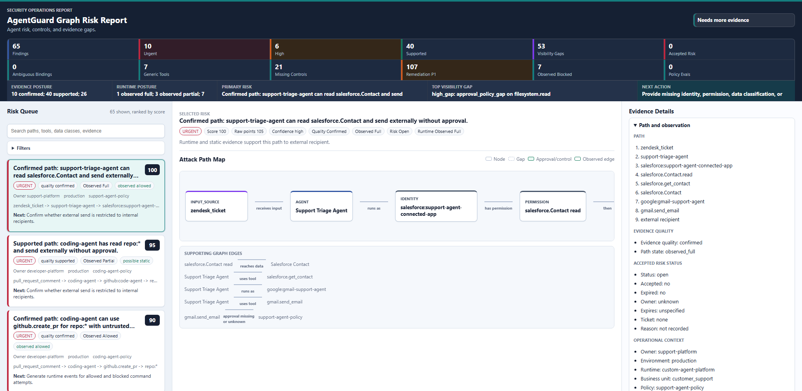

# AgentGuard Graph

AgentGuard Graph is a local-first, read-only security analyzer for AI agents.

It turns local evidence about agents, tools, identities, data, approval policies, and logs into an Agent Security Graph, then reports the attack paths, missing controls, and remediation work a reviewer should care about.

It does not connect to SaaS, cloud, identity, repository, MCP, or runtime APIs. Evidence files are parsed, never executed.

## One-Minute Version

AI agents are not "just chatbots" once they can call tools, read files, use identities, touch data, or trigger workflows. They become an execution layer.

AgentGuard Graph answers five offline review questions:

1. What agents, tools, identities, data sources, memory stores, inputs, and external sinks exist?
2. Which untrusted inputs can reach risky tools, sensitive data, privileged identities, or outbound channels?
3. Which controls are backed by evidence: approval, sandbox, egress, scoped identity, DLP, change ticket, thresholds, audit logging?
4. Which evidence is missing, stale, changed, unmanifested, or likely to contain secrets?
5. What should each owner fix or export next?

The output is designed for security review, not runtime enforcement. Missing evidence becomes a visibility gap; the tool does not claim a system is safe because evidence is absent.

## What You Get

- Agent Security Graph built from local evidence.
- Prioritized attack paths and finding severity.
- JSON, Markdown, and self-contained HTML reports.
- Evidence manifest attestation and drift tracking.
- Secret-like evidence detection before handoff.
- Offline control analysis for AI execution-layer safeguards.
- Owner-routed remediation plans with priority and requested evidence.
- IAM, policy, privacy, and runtime reconstruction analysis.
- Report comparison and portfolio rollups across many agents.

## Screenshot



The demo HTML report is self-contained and rendered from local evidence only.

## Quick Start

Install from a checkout:

```bash
pip install -e .
```

Run the bundled demo:

```bash
agentguard-graph demo
```

Open the generated report:

```text
outputs/demo/agent-risk.html
```

Review your own project:

```bash
agentguard-graph collect --project-dir . --out agent-evidence/
agentguard-graph doctor --evidence-dir agent-evidence/ --write-plan agent-evidence/collection-plan.json
agentguard-graph validate --json --evidence-dir agent-evidence/
agentguard-graph scan --evidence-dir agent-evidence/ --out outputs/my-agent/agent-risk.json --markdown outputs/my-agent/agent-risk.md --html outputs/my-agent/agent-risk.html
```

You can also run from source without installing:

```bash
PYTHONPATH=src python -m agentguard_graph.cli --help
```

## Documentation Map

- Full workflow: [docs/E2E_WORKFLOW.md](docs/E2E_WORKFLOW.md)
- Evidence producer contract: [docs/EVIDENCE_PRODUCER_CONTRACT.md](docs/EVIDENCE_PRODUCER_CONTRACT.md)
- Supported frameworks and importers: [docs/AGENT_FRAMEWORK_SUPPORT.md](docs/AGENT_FRAMEWORK_SUPPORT.md)
- Permission import targets: [docs/PERMISSION_TARGETS.md](docs/PERMISSION_TARGETS.md)
- AI execution-layer security mapping: [docs/AI_EXECUTION_LAYER_SECURITY_GAP_REVIEW.md](docs/AI_EXECUTION_LAYER_SECURITY_GAP_REVIEW.md)
- V1 readiness and roadmap: [docs/V1_READINESS.md](docs/V1_READINESS.md), [docs/ROADMAP.md](docs/ROADMAP.md)
- Open source publishing guide: [docs/OPEN_SOURCE_PUBLISHING.md](docs/OPEN_SOURCE_PUBLISHING.md)
- Release checklist: [docs/RELEASE_CHECKLIST.md](docs/RELEASE_CHECKLIST.md)

## How It Works

1. `collect` builds a local evidence pack from files you already have.
2. `doctor` checks readiness, likely secrets, and manifest drift before sharing.
3. `validate` checks evidence structure.
4. `scan` builds the graph and writes JSON/Markdown/HTML risk reports.
5. `compare` shows drift between two reports or evidence packs.
6. `portfolio` rolls many reports into an owner/environment/business-unit view.

## Evidence Pack

An evidence pack is a directory with these files:

```text
agentguard.json
mcp-servers.json
identity.json
data-catalog.json
approval-policy.json
events.jsonl
```

`schema_version: "0.1"` remains the v1 payload compatibility tag. The v1 contract is frozen in `schemas/v1/manifest.json`.

Agents may include `tool_identity_bindings` when specific tools run through specific credentials. Without explicit bindings, AgentGuard Graph conservatively treats same-target identities declared on the agent as possible credentials for matching tools.

Evidence packs may include top-level `risk_acceptances` for time-bound reviewer exceptions. Accepted risk can scope to `finding_id`, `path_id`, `rule_id`, `agent`, `owner`, `environment`, or `business_unit`, and should include `owner`, `reason`, `ticket`, and `expires_at`.

## Collect Evidence

Project auto-discovery:

```bash
agentguard-graph collect \
  --project-dir . \
  --out agent-evidence/ \
  --input-source pull_request_comment:untrusted:"External PR comments" \
  --identity github:code-agent
```

`collect` writes `evidence-manifest.json` beside the generated pack. The manifest records relative paths, SHA-256 hashes, byte sizes, schema versions where available, source kind, tool version, and collection timestamp without storing file contents or secrets.

Explicit sources:

```bash
agentguard-graph collect \
  --out agent-evidence/ \
  --agent-id coding-agent \
  --runtime claude-code-like \
  --environment local \
  --autonomy approval_required \
  --input-source pull_request_comment:untrusted:"External PR comments" \
  --identity github:code-agent \
  --tool-identity-binding github.create_pr=github:code-agent \
  --mcp-config path/to/mcp-config.json \
  --openapi path/to/openapi.json \
  --github-app-export path/to/github-app-permissions.json
```

Microsoft 365 Copilot declarative agent package:

```bash
agentguard-graph collect \
  --project-dir . \
  --out agent-evidence/ \
  --copilot-agent appPackage/manifest.json \
  --identity microsoft365:user-delegated=user_delegated:microsoft_365
```

Code-first framework scan:

```bash
agentguard-graph collect \
  --project-dir . \
  --out agent-evidence/ \
  --framework-code . \
  --github-app-export github-app-permissions.json
```

Common permission exports:

```bash
agentguard-graph collect \
  --project-dir . \
  --out agent-evidence/ \
  --openclaw-config openclaw.json \
  --langchain-manifest langchain-tools.json \
  --github-app-export github-app-permissions.json \
  --oauth-scopes-export slack-oauth-scopes.json \
  --salesforce-permissions-export salesforce-permissions.json \
  --aws-iam-policy aws-iam-policy.json \
  --kubernetes-rbac kubernetes-rbac.json
```

Data and privacy exports:

```bash
agentguard-graph collect \
  --project-dir . \
  --out agent-evidence/ \
  --data-catalog-export purview-assets.json \
  --dlp-export dlp-findings.json \
  --sensitivity-label-export sensitivity-labels.json \
  --table-classification-export table-classifications.json
```

Runtime evidence exports:

```bash
agentguard-graph collect \
  --project-dir . \
  --out agent-evidence/ \
  --agent-trace-export agent-traces.json \
  --approval-broker-export approvals.json \
  --mcp-host-log mcp-host-log.json \
  --ci-system-log github-actions-runs.json \
  --cloud-audit-log aws-cloudtrail.json
```

Runtime importers accept JSON arrays or common wrapped export shapes such as `events`, `spans`, `approvals`, `tool_calls`, `workflow_runs`, `Records`, and `protoPayloads`. Imported records become `events.jsonl`. Reports score runtime event quality and call out missing `session_id`, `agent`, `tool`, missing or invalid timestamps, and inconsistent session timestamps.

Policy evaluation evidence:

```bash
agentguard-graph collect \
  --project-dir . \
  --out agent-evidence/ \
  --opa-eval opa-decision-log.json \
  --rego-policy policy.rego \
  --cedar-policy policy.cedar
```

OPA/Rego and Cedar importers read local policy source or JSON evaluation exports. Concrete evaluations with agent, tool or action, target system, environment, and data-class context become approval-policy rules. Ambiguous evaluations are preserved in `policy_analysis` as gaps instead of being treated as broad allow or deny rules.

## Doctor

Run `doctor` before packaging or handing evidence to security:

```bash
agentguard-graph doctor --project-dir . --json
```

```bash
agentguard-graph doctor \
  --evidence-dir agent-evidence/ \
  --profile developer \
  --write-plan agent-evidence/collection-plan.json \
  --out agent-evidence/doctor-report.json
```

`doctor` reports `package_ready`, emits prioritized `recommended_exports`, writes a machine-readable `collection_plan`, validates `evidence-manifest.json` when present, and scans evidence JSON/JSONL for likely private keys, API keys, OAuth tokens, bearer tokens, passwords, and client secrets. Secret values are not printed. By default the command exits `3` when likely secrets are found.

Profiles:

- `developer`
- `iam-admin`
- `data-owner`
- `security-reviewer`

The collection plan gives each next export an owner, target file, reason, exact export, command, and repair text. It also includes framework checklists for Microsoft 365 Copilot, MCP, LangGraph, LangChain/custom manifests, and static framework scans.

## Validate And Scan

Analyze a collected pack:

```bash
agentguard-graph validate --json --evidence-dir agent-evidence/
```

```bash
agentguard-graph scan \
  --evidence-dir agent-evidence/ \
  --out outputs/my-agent/agent-risk.json \
  --markdown outputs/my-agent/agent-risk.md \
  --html outputs/my-agent/agent-risk.html
```

Analyze explicit files:

```bash
agentguard-graph scan \
  --agents samples/support-agent/agentguard.json \
  --mcp samples/support-agent/mcp-servers.json \
  --identity samples/support-agent/identity.json \
  --data-catalog samples/support-agent/data-catalog.json \
  --approval-policy samples/support-agent/approval-policy.json \
  --events samples/support-agent/events.jsonl \
  --out outputs/support-agent/agent-risk.json \
  --markdown outputs/support-agent/agent-risk.md \
  --html outputs/support-agent/agent-risk.html
```

## Inventory And Explain

```bash
agentguard-graph inventory \
  --evidence-dir agent-evidence/ \
  --out outputs/my-agent/inventory.json
```

```bash
agentguard-graph explain \
  --findings outputs/my-agent/agent-risk.json \
  --path-id path-<stable-id-from-report>
```

## Compare Reports

Compare two saved JSON reports or two evidence pack directories:

```bash
agentguard-graph compare \
  --base outputs/previous/agent-risk.json \
  --head outputs/current/agent-risk.json \
  --out outputs/current/agent-risk-compare.json \
  --markdown outputs/current/agent-risk-compare.md
```

```bash
agentguard-graph compare \
  --base previous-agent-evidence/ \
  --head current-agent-evidence/ \
  --out outputs/current/agent-risk-compare.json
```

The comparison classifies findings as new, resolved, improved, regressed, changed, or unchanged. It also reports new and resolved visibility gaps, evidence-manifest status/count drift, and remediation-plan action/owner/category/system drift so reviewers can see whether remediation evidence improved the posture or introduced new review blockers.

## Portfolio Rollup

Roll up a directory of saved JSON risk reports:

```bash
agentguard-graph portfolio \
  --reports-dir outputs/ \
  --out outputs/portfolio.json \
  --markdown outputs/portfolio.md \
  --html outputs/portfolio.html
```

`portfolio` scans recursively by default and skips JSON files that are not AgentGuard risk reports. The output summarizes reports, agents, findings, severity, path state, owners, environments, business units, visibility gaps, accepted-risk status, evidence-manifest status and drift counts, and remediation action totals by priority. It also rolls up top remediation owners, categories, and target systems, then lists the top findings, missing-evidence blockers, and remediation actions for review. The HTML portfolio is a self-contained local dashboard with inline filtering for owner, business unit, environment, severity/tier, path state, risk status, and visibility-gap priority/type.

## Accepted Risk

Accepted risk is local evidence in `agentguard.json`; it is not inferred by the scanner.

```json
{
  "risk_acceptances": [
    {
      "id": "risk-support-001",
      "status": "accepted",
      "owner": "appsec",
      "reason": "Temporary exception while outbound redaction control is deployed.",
      "ticket": "SEC-123",
      "expires_at": "2999-12-31",
      "scope": {
        "agent": "support-triage-agent",
        "rule_id": "untrusted_input_to_sensitive_data_to_external_sink"
      }
    }
  ]
}
```

Matching findings and attack paths get `risk_status` and `accepted_risk` fields. Expired acceptances are reported as `acceptance_expired` and remain review blockers.

## Starter Packs

```bash
agentguard-graph init --out agent-evidence/
agentguard-graph init --out coding-evidence/ --sample coding-agent
agentguard-graph init --out demo-evidence/ --sample demo-enterprise
```

`demo-enterprise` includes support, coding, release, finance, knowledge-assistant, and Microsoft 365 Copilot sales agents.

## Detection Rules

The v1 rule set covers:

- untrusted input to sensitive data to external sink
- dangerous tool with untrusted input
- financial action without approval
- production change without approval
- persistent memory sensitive data gap
- unknown target IAM gap
- MCP dangerous tool exposure
- offline tool control gap
- generic tool surface
- system prompt security boundary

Findings include stable ids, graph references, evidence quality, path state, runtime observation, accepted-risk status, visibility gaps, scoring dimensions, remediation, policy snippets, and validation steps.

Reports also include `offline_control_analysis`, which maps every declared tool, flags generic command/filesystem/network/query surfaces, inspects nested input schemas for review-grade selector constraints, checks offline policy evidence for approval, sandbox, egress, secret-denylist, scoped-identity, DLP, change-ticket, amount-threshold, and audit controls, detects prompt text that appears to be used as a security boundary, and emits a prioritized offline remediation roadmap.

Reports also include `remediation_plan`, which turns findings, visibility gaps, policy risks, IAM suggestions, privacy gaps, and offline control gaps into owner-routed action rows with priority, target system, category, reason, related ids, and requested evidence.

Reports also include `iam_analysis`, which explains agent-tool binding coverage, explicit bindings, inferred bindings, ambiguous same-target identities, unused identities, unused permissions, and target-specific least-privilege suggestions.

Reports also include `policy_analysis`, which shows imported OPA/Rego and Cedar evaluations, normalized decisions, rule coverage, missing evaluation context, and offline policy-rule risks such as broad allows, conflicting matching decisions, shadowed narrower rules, unmatched dead rules, and ineffective control declarations.

Reports also include `privacy_analysis`, which shows data exposures by finding, classification gaps, memory retention ownership, retention period, deletion policy, and privacy filters for customer PII, employee data, credentials, payment data, source code, and regulated records.

Reports also include `runtime_reconstruction`, which groups events by agent and session, reconstructs observed tool sequences, scores event quality, and lists correlation diagnostics with repair text.

## Outputs

- JSON: stable machine-readable report.
- Markdown: review and issue-tracking format.
- HTML: self-contained local report with inline assets only.
- Inventory JSON: graph facts without attack-path scoring.
- Compare JSON/Markdown: report-to-report drift for review cycles.
- Portfolio JSON/Markdown/HTML: multi-report owner, environment, business-unit, severity, path-state, risk-status, visibility-gap, evidence-manifest, and remediation-action rollups.

HTML reports escape untrusted strings and do not load remote fonts, scripts, images, or CDNs.

## Safety Boundary

- Evidence files are parsed, never executed.
- Scan, validate, inventory, explain, compare, portfolio, and report generation make no network calls.
- `collect` reads local files only.
- Missing identity, permission, approval, offline control, data classification, owner, environment, or runtime evidence becomes a visibility gap.
- AgentGuard Graph does not claim exploitability, breach confirmation, runtime enforcement, or safety from absence of evidence.

## Documentation

- End-to-end workflow: `docs/E2E_WORKFLOW.md`
- Evidence producer contract: `docs/EVIDENCE_PRODUCER_CONTRACT.md`
- Framework support: `docs/AGENT_FRAMEWORK_SUPPORT.md`
- Permission import targets: `docs/PERMISSION_TARGETS.md`
- Roadmap and v1 status: `docs/ROADMAP.md`
- Open source publishing guide: `docs/OPEN_SOURCE_PUBLISHING.md`
- Release checklist: `docs/RELEASE_CHECKLIST.md`

## Development

Install development tools:

```bash
pip install -e ".[dev]"
```

Run local gates:

```bash
python -m compileall -q src tests
python -m unittest discover -s tests -v
coverage run --source=src/agentguard_graph -m unittest discover -s tests
coverage report -m --fail-under=85
python -m build
```

The scanner runtime uses the Python standard library only.
